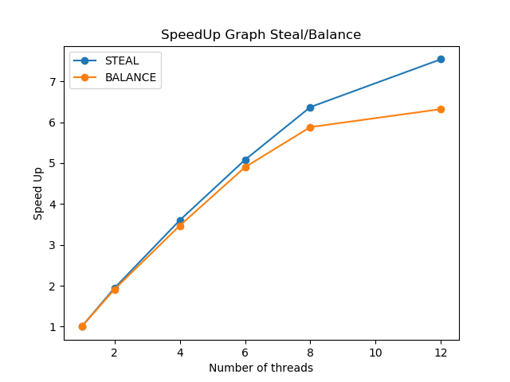

# Random Forest

### Sample code to run the program 
for serial: go run randomforest/tree.go s 200 4  
for stealing: go run randomforest/tree.go stl 200 4 8 10  
for balancing: go run randomforest/tree.go bal 200 4 8 10 2

### Observations

The code is speeding up well on increasing the number of threads. The speed up is almost linear to start with and it starts decreasing after a point as the overhead cost starts increasing. What the code does and what part has been parallelised has been answered in the next segment.  
The graph generated by the code is given below:  

### System and the problem solved

The code implements a machine learning method - Random Forest, to solve a classification problem.  
It assumes that the data given has n-1 X variables and the last column is the y variable. Then, the code splits the given data into train and test, with 30% data reserved for testing. Post this, the data is sent to the algorithm for classification. The algorithm randomly takes sqrt(n) columns (also called features) and runs the decision tree algorithm on it. This is done repeatedly for around 200 trees and then for any random data (test data in our case), each tree predicts what should be the class for a given line item and the class which has the highest votes is declared as the class for the given dataset. This is also called the wisdon of the crowds.  
For our case, a task is training a decision tree, since each tree can be trained independent of the others, the task is easily parallelisable. 

### A description of implementation of parallel solutions

The stealing algorithm keeps taking items from the global queue till either the threshold is crossed or there are no more items in the global queue. If at that time, there are more than 0 elements in the queue, the thread does work on the tasks it has in the queue. However, if the thread checks in the global queue and there are no elements in it, it tries to steal work from one of the other threads and if it is successful, it does work and the process is repeated.  
The distribution algorithm keeps taking items from the global queue till either the threshold is crossed or there are no more items in the global queue. If at that time, there are more than 0 elements in the queue, the thread does work on the tasks it has in the queue. After each task, the thread generates a random number between the number 1 and the number of elements in the queue and if that is equal to the number of items in the queue, then work distribution happens. Here, a thread is selected at random and if the absoluted difference between the number of elements in the thread selected and this thread is greater than a threshold value, the tasks are distributed till both have same number of tasks.

### Challenges faced

The main challenge while implementing the systems was to get a good hang of how futures work and how interfaces are typecasted for callables and runnables. This was the major challenge while doing this assignment, and learning this helped in getting a better understanding of how some values can be returned despite them not being calculated at the moment. 

### Specifications of the testing machine

I tested the code on linux6 terminal. Below are the details of the same:  

CPU op-mode(s):                  32-bit, 64-bit  
CPU(s):                          64  
On-line CPU(s) list:             0-63  
Thread(s) per core:              2  
Core(s) per socket:              16  
Socket(s):                       2  
Model name:                      Intel(R) Xeon(R) Silver 4216 CPU @ 2.10GHz  

### Hotspots/bottlenecks

The hotspots are making the trees which I was able to parallelise.  
The bottleneck is the preprocessing of the data and finally convergin result from all the trees which cant be parallelised because of the data dependencies involved.
